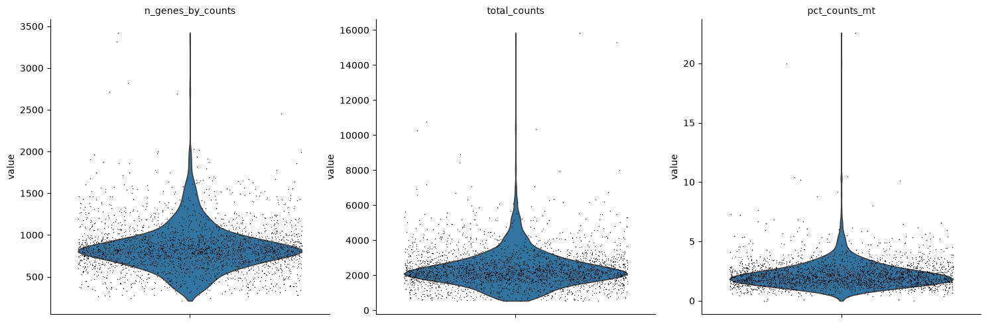
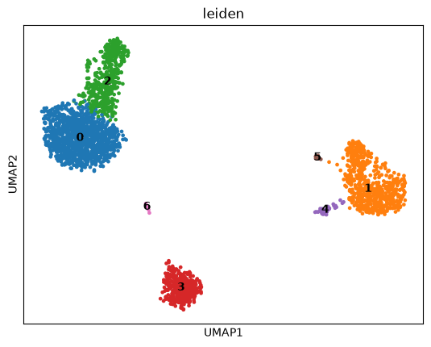
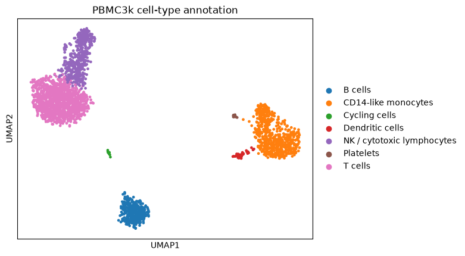
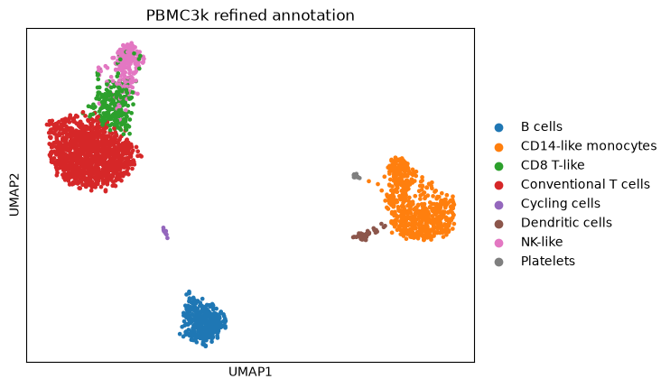
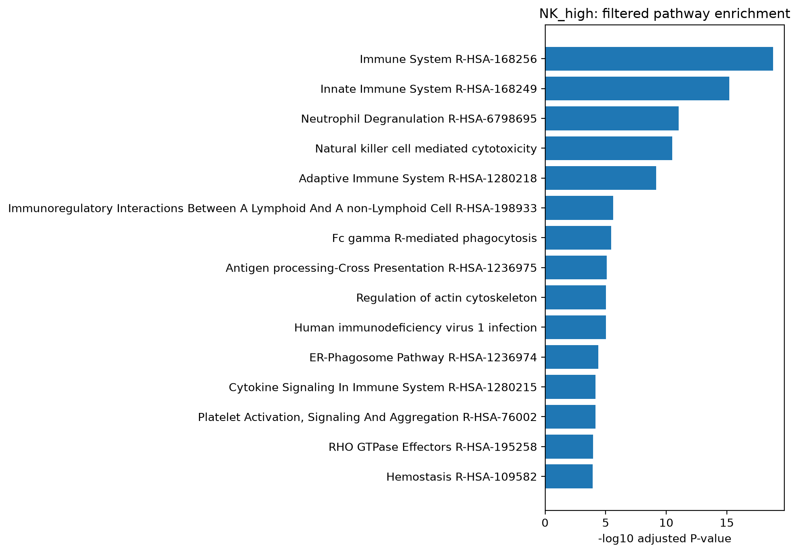
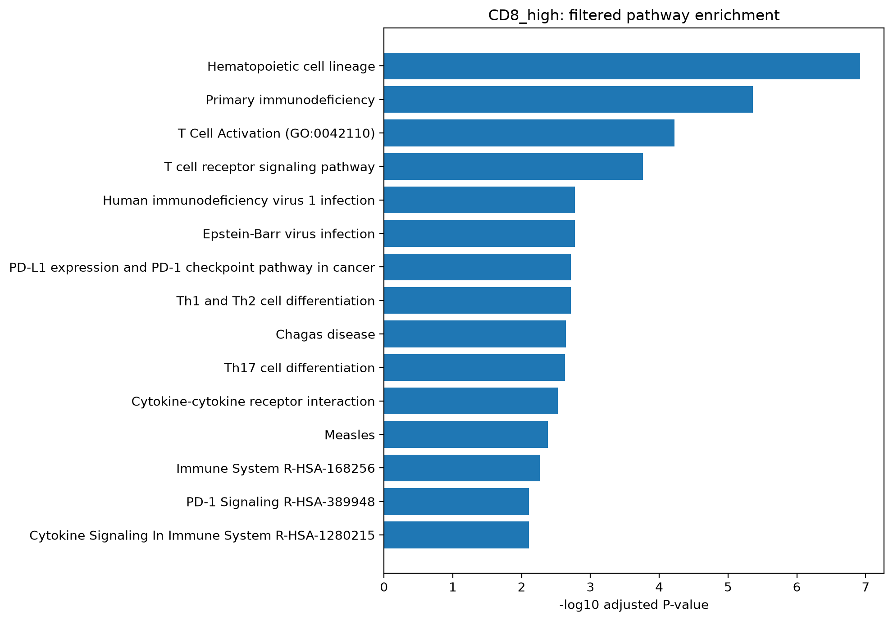

# Scanpy Single-Cell RNA-seq Analysis — PBMC3k

End-to-end single-cell RNA-seq analysis using **Scanpy** and the PBMC3k dataset, covering quality control, normalization, dimensionality reduction, graph-based clustering, marker-based annotation, hierarchical subclustering, differential expression, and pathway enrichment.

## Overview

```text
Raw counts
   ↓
QC / filtering
   ↓
Normalization + log1p
   ↓
Highly variable genes
   ↓
PCA
   ↓
KNN graph
   ├── UMAP visualization
   └── Leiden clustering
          ↓
     Marker discovery
          ↓
   Cell-type annotation
          ↓
Hierarchical subclustering
          ↓
CD8 T-like vs NK-like refinement
          ↓
Differential expression
          ↓
Pathway enrichment
          ↓
Biological interpretation
```

## Dataset

This project uses the **PBMC3k** teaching dataset provided through Scanpy:

```python
import scanpy as sc

adata = sc.datasets.pbmc3k()
```

PBMC3k contains approximately 3,000 peripheral blood mononuclear cells profiled by single-cell RNA sequencing.

## Core scRNA-seq workflow

The Day 6 analysis performs:

- quality-control metric calculation
- mitochondrial RNA assessment
- cell and gene filtering
- total-count normalization
- `log1p` transformation
- highly variable gene selection
- scaling
- PCA
- K-nearest-neighbor graph construction
- UMAP visualization
- Leiden clustering
- marker-gene discovery
- broad cell-type annotation

### Broad cell-type composition

| Cell type | Cells | Fraction |
|---|---:|---:|
| T cells | 1170 | 44.27% |
| CD14-like monocytes | 640 | 24.21% |
| NK / cytotoxic lymphocytes | 436 | 16.50% |
| B cells | 341 | 12.90% |
| Dendritic cells | 36 | 1.36% |
| Platelets | 12 | 0.45% |
| Cycling cells | 8 | 0.30% |

### Representative markers

| Cell population | Representative markers |
|---|---|
| T cells | `CD3D`, `CD3E`, `IL7R`, `CCR7` |
| Monocytes | `LYZ`, `LST1`, `S100A8`, `S100A9` |
| NK / cytotoxic cells | `NKG7`, `GNLY`, `PRF1`, `CCL5` |
| B cells | `MS4A1`, `CD79A`, `CD74` |
| Dendritic cells | `FCER1A`, `CST3`, `HLA-DRA` |
| Platelets | `PPBP`, `PF4` |
| Cycling cells | `TYMS`, `PCNA` |

##  Hierarchical subclustering

The broad lymphoid compartment was further analyzed using hierarchical subclustering.

A mixed cytotoxic lymphocyte population was re-clustered and refined into:

- **CD8 T-like cells**
- **NK-like cells**

### NK-like differential-expression signature

Representative NK-high genes included:

- `GZMB`
- `NKG7`
- `FGFBP2`
- `PRF1`
- `FCGR3A`
- `GNLY`
- `TYROBP`
- `FCER1G`
- `CCL4`

These genes support a mature cytotoxic NK-like phenotype.

## Differential expression

Differential expression was performed between refined **NK-like** and **CD8 T-like** populations.

Representative NK-high genes:

```text
GZMB
NKG7
FGFBP2
PRF1
FCGR3A
GNLY
TYROBP
FCER1G
```

## Pathway enrichment

Pathway enrichment was performed using **gseapy / Enrichr** with:

- GO Biological Process
- Reactome
- KEGG

### NK-like enrichment

NK-high genes showed strong enrichment for:

- Natural killer cell mediated cytotoxicity
- Innate Immune System
- Fc gamma receptor-associated processes
- Immunoregulatory interactions
- Interferon signaling

Representative result:

```text
Natural killer cell mediated cytotoxicity
Adjusted P-value ≈ 3.2 × 10^-11
Odds Ratio ≈ 23.4
```

### CD8 T-like enrichment

The initial CD8-high enrichment was dominated by ribosomal and translational pathways.

For exploratory biological interpretation, a secondary enrichment analysis excluded strongly ribosomal, mitochondrial, histone, and selected housekeeping-dominated genes.

After filtering, the CD8 T-like population showed enrichment for:

- T Cell Activation
- T cell receptor signaling pathway
- Hematopoietic cell lineage
- CD3 and TCR-zeta phosphorylation
- ZAP-70 signaling
- Th1 / Th2 differentiation
- PD-1 signaling

Both unfiltered and filtered enrichment results are retained for transparency.

## Biological interpretation

Hierarchical subclustering separated the cytotoxic lymphocyte compartment into CD8 T-like and NK-like populations.

NK-like cells showed increased expression of `GZMB`, `NKG7`, `FGFBP2`, `PRF1`, `FCGR3A`, `GNLY`, `TYROBP`, and `FCER1G`, accompanied by enrichment of natural killer cell-mediated cytotoxicity and innate immune pathways.

After filtering housekeeping-dominated genes for exploratory pathway interpretation, CD8 T-like cells showed enrichment of T-cell activation, T-cell receptor signaling, CD3/TCR phosphorylation, ZAP-70 signaling, and related adaptive immune programs.

## Selected figures

### Quality control



### Leiden clustering



### Broad cell-type annotation



### Refined annotation



### NK-like pathway enrichment



### CD8 T-like pathway enrichment



## Key concepts demonstrated

- Scanpy / AnnData
- scRNA-seq quality control
- library-size normalization
- highly variable gene selection
- PCA
- KNN graph construction
- UMAP
- Leiden clustering
- marker-gene analysis
- cell-type annotation
- hierarchical subclustering
- differential-expression analysis
- pathway enrichment
- biological interpretation

## Important conceptual points

### UMAP is not clustering

```text
Expression matrix
       ↓
      PCA
       ↓
 KNN neighbor graph
   ├── UMAP
   └── Leiden
```

UMAP is primarily a visualization method, whereas Leiden performs graph-based community detection.

### Cell type is not the same as cell state

```text
T cell / B cell / monocyte
→ cell type / lineage

cycling / exhausted / interferon-responsive
→ cell state
```

For this reason, the proliferative cluster was conservatively annotated as **Cycling cells** rather than being assigned to a specific lineage without sufficient evidence.

## Project structure

```text
D6_scanpy_scrnaseq/
├── scripts/
│   ├── day6_pbmc3k.py
│   ├── day6_annotate.py
│   ├── day7_interpret.py
│   ├── day7_refine_cytotoxic.py
│   ├── day7_pathway.py
│   └── day7_pathway_filtered.py
├── figures/
├── outputs/
├── README.md
└── .gitignore
```

## Reproduce

Create an environment:

```bash
conda create -n singlecell python=3.11 -y
conda activate singlecell
```

Install dependencies:

```bash
pip install scanpy anndata pandas numpy matplotlib scikit-learn igraph leidenalg gseapy
```

Run the workflow:

```bash
python scripts/day6_pbmc3k.py
python scripts/day6_annotate.py
python scripts/day7_interpret.py
python scripts/day7_refine_cytotoxic.py
python scripts/day7_pathway.py
python scripts/day7_pathway_filtered.py
```

The Enrichr pathway-analysis steps require internet access.

## Methodological note

PBMC3k is a teaching dataset and does not contain a multi-patient case/control experimental design.

The differential-expression analysis in this repository compares cell populations and should **not** be interpreted as disease-associated differential expression.

For patient-level studies, biological replication, sample-level covariates, batch effects, and approaches such as pseudobulk differential expression should be considered.

The housekeeping-gene-filtered pathway analysis is used for exploratory biological interpretation. The original unfiltered pathway results are also retained.

## Disclaimer

This repository is an educational and research demonstration and is not intended for clinical diagnosis or treatment decisions.
